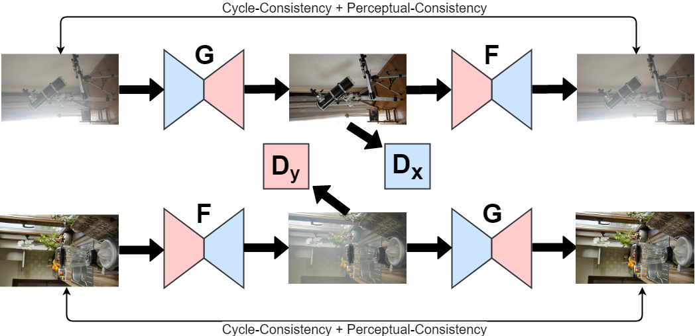

# Cycle-Dehaze: Enhanced CycleGAN for Single Image Dehazing

This reposotory is our project for <a href="http://www.vision.ee.ethz.ch/ntire18/" target="_blank">NTIRE 2018 Challenge on Image Dehazing</a>. 

<a href="https://arxiv.org/abs/1805.05308" target="_blank">Our paper</a> published in CVPR 2018 Workshop <a href="http://www.vision.ee.ethz.ch/ntire18/" target="_blank">(3rd NTIRE)</a>. Please cite our paper, if it is helpful for your research.

```sh
@inproceedings{engin2018cycle,
  title={Cycle-Dehaze: Enhanced CycleGAN for Single Image Dehazing},
  author={Engin, Deniz and Gen{\c{c}}, An{\i}l and Ekenel, Haz{\i}m Kemal},
  booktitle={The IEEE Conference on Computer Vision and Pattern Recognition (CVPR) Workshops},
  year={2018}
}
```

## Model Architecture



## Prerequisites

* TensorFlow 1.4.1 or later
* Python 3
* MATLAB 

Our code is tested under Ubuntu 16.04 environment with Titan X GPUs.

## Demo

* Test the model for Track 1: Indoor

```sh
 sh demo.sh data/indoor results/indoor models/Hazy2GT_indoor.pb
```

* Test the model for Track 2: Outdoor

```sh
sh demo.sh data/outdoor results/outdoor models/Hazy2GT_outdoor.pb
```

*  You can use this model for your own images. 

```sh
sh demo.sh input_folder output_folder model_name
```

## License
This project is licensed under the MIT License - see the <a href="https://github.com/engindeniz/Cycle-Dehaze/blob/master/LICENSE">LICENSE</a> file for details.

## Acknowledgments

The code is based on <a href="https://github.com/vanhuyz/CycleGAN-TensorFlow" target="_blank">CycleGAN-TensorFlow</a> implementation. 

